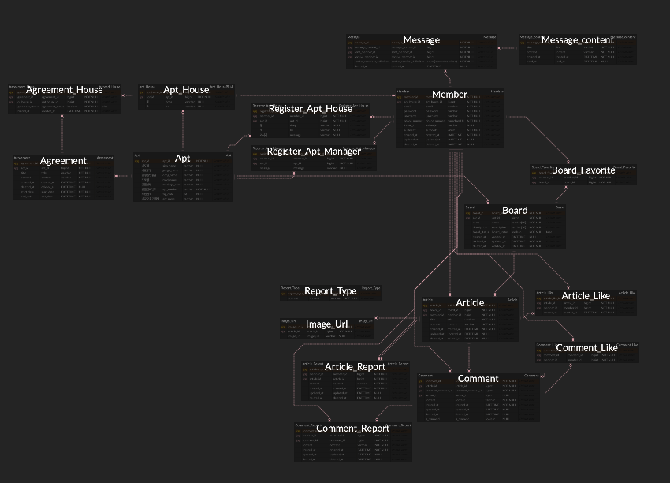
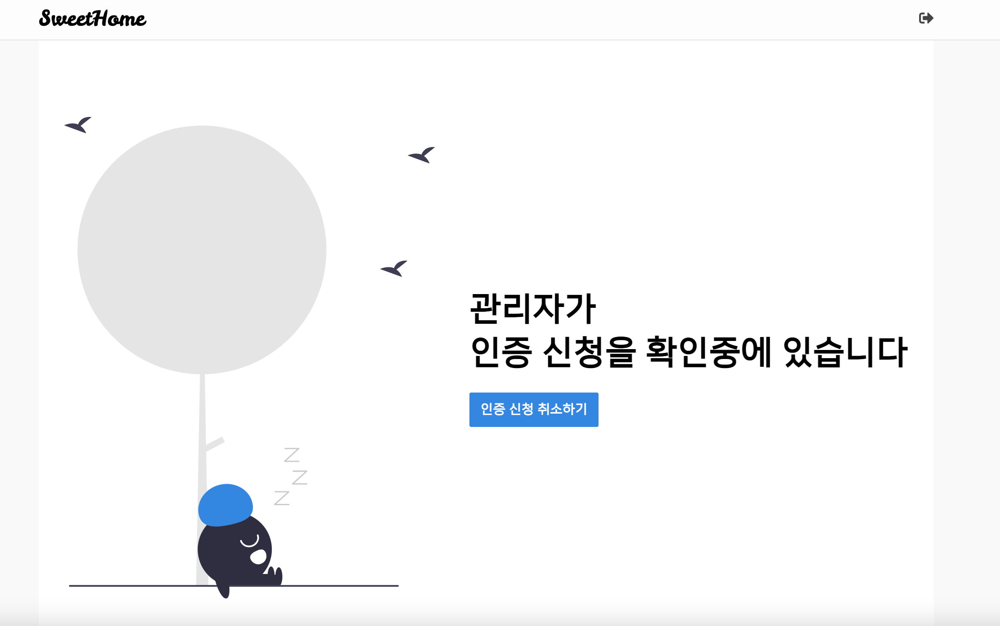
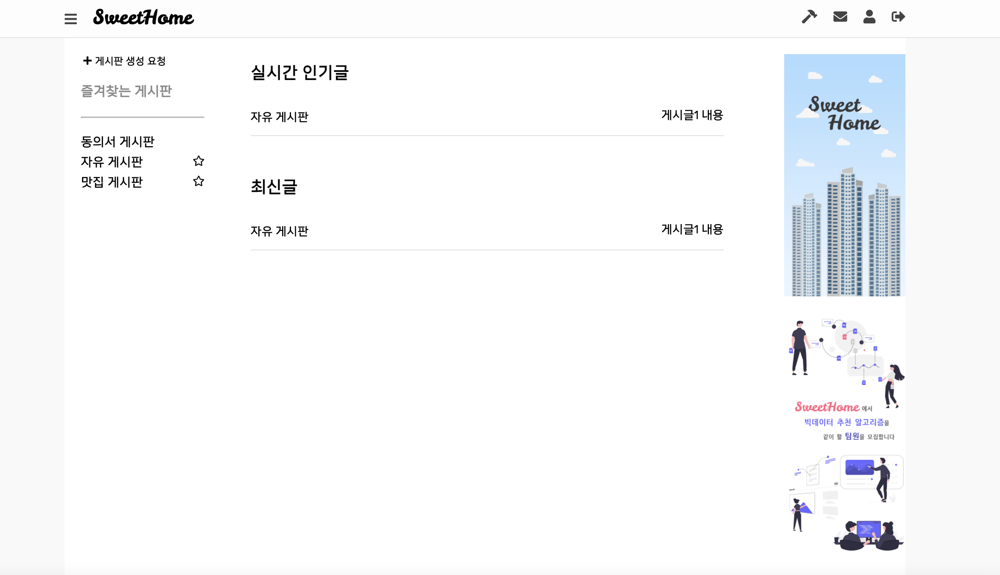
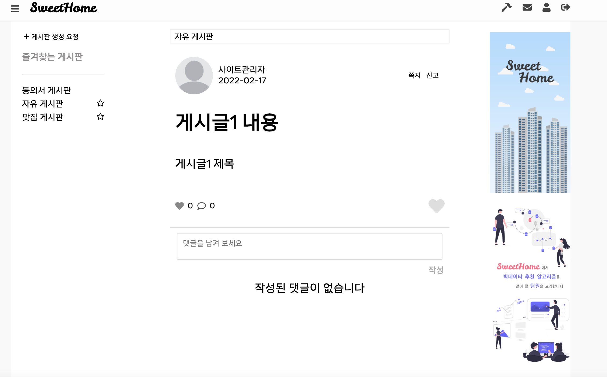
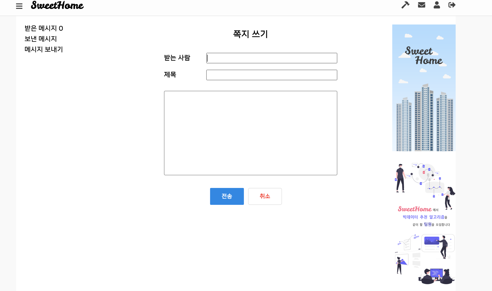

# SweetHome

동일 아파트내의 입주민들끼리 소통을 위한 웹 커뮤니티 서비스


## 기획 배경

1. 실생활에서 발생하는 문제들을 해결하는데 도움을 주고자 하는 서비스를 기획
2. 아파트 거주 인구가 급상승 하며 생기는 문제점들을 해결하기 위해 서비스 구현


## 📅 프로젝트 기간

- 22.01.10 ~ 22.02.18


## 프로젝트 사용법

로컬 웹 서버 실행 방법

##### Frontend

```
$ cd frontend
$ npm install
# 로컬 서버 실행
$ npm start
```

##### Backend

```
$ cd backend
$ ./gradlew bootRun
```


## **🧰 사용기술**

##### Frontend

* React, Redux, html/css

##### Backend

* Java, Springboot, JPA

##### Server

* Nginx, AWS, Docker

##### DB

* MySQL


## 아키텍쳐


### 데이터베이스 모델링(ERD)




## 메인 기능

#### 1) 홈 화면

* 회원가입 클릭하여 회원가입 페이지로 이동
* 비밀번호 잊으셨나요 클릭시 비밀번호 찾기 페이지로 이동
* 카카오 로그인 클릭시, 카카오 로그인이 되어있다면 자동으로 회원가입후 메인페이지로 이동
* 로그인 되어있지 않다면 카카오 로그인 창 표시


#### 2) 회원 가입 화면

* 이메일과 비밀번호 입력 후 가입 버튼 클릭 후 자동으로 메인화면으로 이동


#### 3) 준회원 메인 화면

* 아파트 세대원 인증하러 가기를 클릭하여 페이지 이동
* 아파트 관리자 인증하러 가기를 클릭하여 페이지 이동


#### 4) 아파트 세대원 인증 페이지

* 주소 찾기 버튼 클릭 및 주소 검색 후 동, 호수 수동으로 입력
* 이후, 제출하기 버튼 


#### 5) 아파트 관리자 인증 페이지

* 주소 찾기 버튼 클릭 및 주소 검색 
* 이후, 제출하기 버튼 


#### 6) 인증 요청 성공 페이지

* 인증 신청 이후 변경된 메인 페이지



#### 7) 정회원 등급 이후, 메인 화면

* SweetHome 로고 클릭시 메인화면으로 이동
* 좌측상단 햄버거 메뉴 모양으로 사이드 바 toggle 처리
* 우측 상단 망치 모양 클릭시 관리자 페이지로 이동
* 우측 상단 쪽지 아이콘 클릭시 쪽지 페이지로 이동
* 우측 상단 사람 아이콘 클릭시 프로필 페이지로 이동
* 우측 상단 출입구 아이콘 클릭시 로그아웃 처리
* 좌측의 게시판 생성 요청 클릭시 게시판 생성 요청을 작성할 수 있는 모달 창이 표시
* 게시판 이름 클릭시 해당 게시판 페이지로 이동
* 게시판 옆의 별 모양을 누를 시 해당 게시판을  즐겨찾기 게시판에 추가
* 실시간 인기글, 최신글에서 게시글 제목 클릭시 해당 게시글 상세 페이지로 이동



#### 8) 게시판

* 새글을 작성해주세요 클릭시 아래에 textarea 표시
* 게시글 제목 클릭시 해당 게시글 상세페이지로 이동


#### 9)  게시글 상세페이지

* 쪽지 클릭시 해당 유저에게 쪽지 보내는 팝업 창 실행
* 신고 클릭시 해당 게시글을 신고하는 팝업 창 실행
* 하트 아이콘 클릭시 좋아요 수 1 및 빨강색으로 변경
* 댓글을 남기고 작성시 아래에 댓글이 생성됨



#### 10) 동의서

* 관리자만 동의서 생성이 가능
* 동의성 생성을 누르면 동의서 생성 모달 창이 출력
* 제목을 누르면 해당 동의서의 상세페이지로 이동


* 동의, 반대를 선택하여 제출 가능


#### 11) 쪽지

* 받은 메시지 클릭시 받은 메시지함 표시
* 보낸 메시지 클릭시 보낸 메시지함 표시
* 메시지 보내기 클릭시 메시지 보내기 창 표시
* 제목 클릭시 해당 쪽지의 상세 페이지로 이동
* 체크박스 클릭후 삭제버튼 클릭후 해당 쪽지 삭제
* 안읽은 쪽지부터 정렬
* 받는사람, 제목, 내용 입력 이후 전송 버튼 클릭시 해당 유저에게 쪽지 전송




#### 12) 프로필

* 회원정보 클릭시 해당 유저의 정보 표시
* 사람 아이콘 클릭시 프로필 설정 가능
* 닉네임, 이메일 등 개인정보 입력후 저장 버튼 누를시 새로운 정보로 변경
* 내가 작성한 글 클릭시 본인이 작성한 글 목록 표시
* 글 제목 클릭시 해당 글의 상세 페이지로 이동
* 내가 작성한 댓글 클릭시 본인이 작성한 댓글 목록 표시
* 글 제목 또는 댓글 클릭시 해당 글의 상세 페이지로 이동
* 이사가기 클릭시 이사기기 페이지 표시
* 주소 찾기 버튼 클릭 및 주소 입력 후 제출하기 버튼 클릭시 이사가기 요청 
* 제출 성공시, 관리자가 신청 확인중이라는 페이지 표시


## 팀원 소개 및 소감

* **우동진(팀장 / Frontend)**

  많은것을 배운 프로젝트였습니다. 먼저,  React와 Redux를 스스로 공부하고 사용하며 React의 장점인 컴포넌트 재사용을 효율적으로 생각하며 코드 구현을 함으로써 이전보다 성장할 수 있었습니다.  또한 협업을 하며 필요한 Git flow와 지라를 활용하며 협업에 좀 더 익숙해질 수 있는 기회였습니다. 마지막으로 이번 프로젝트를 진행하며 기획 부분이 조금 부족했다는 것을 느꼈고 코드 구현만큼 기획이 얼마나 중요한지 깨닫게 된 프로젝트였습니다. 


### 기타

#### Git convention

```
$ git commit -m [#'이슈번호'] 타입 : 작업 설명 
```

* 과거시제 및 첫 시작을 대문자로 사용하지 않는다


##### 커밋메시지 타입

| git status | 의미                                      |
| ---------- | ----------------------------------------- |
| feature    | 기능 작업 시 사용                         |
| doc        | 문서 작업 시 사용                         |
| style      | 스타일 작업 시 사용                       |
| refactor   | 코드 리팩토링 시 사용                     |
| fix        | 버그 수정시 사용                          |
| chore      | 빌드 업무 수정, 패키지 매니저 수정시 사용 |


