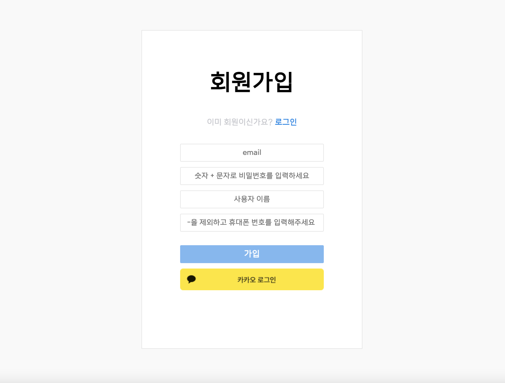
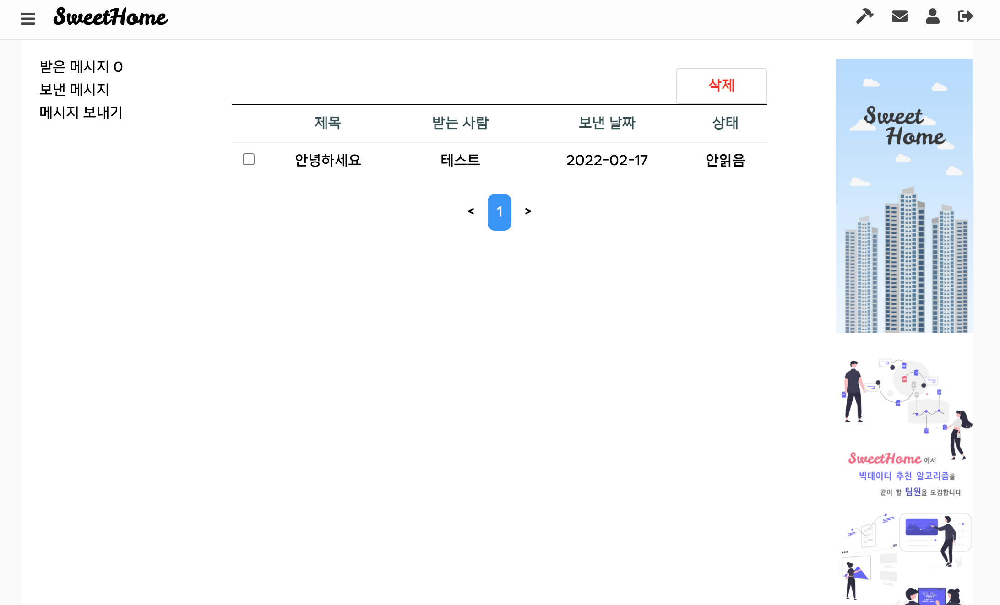
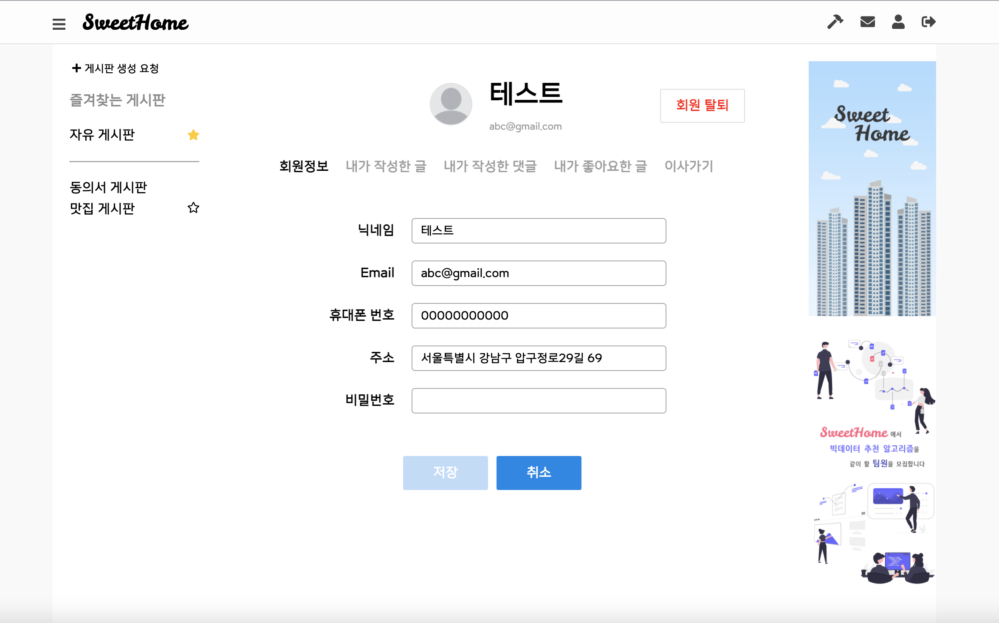
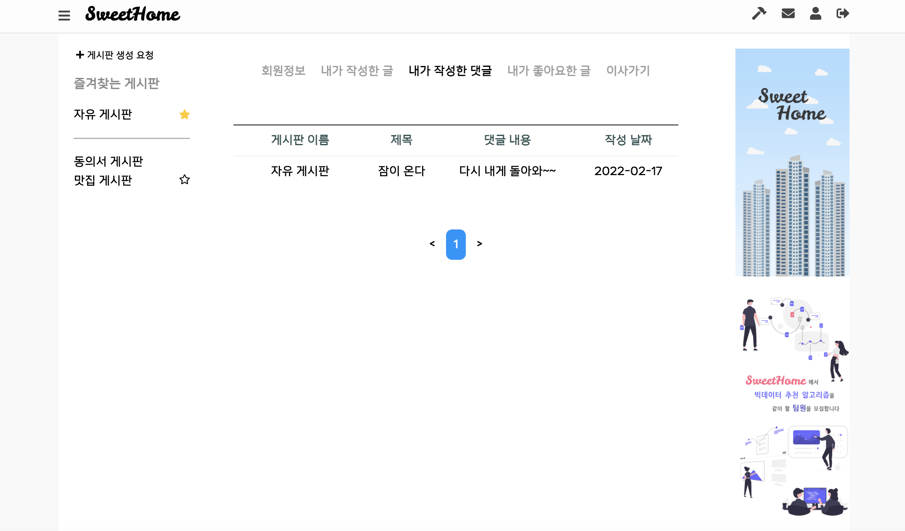

## 시연 시나리오(화면별 상세설명)

site 화면별 상세 설명

##### 1) 홈 화면

* 회원가입 클릭하여 회원가입 페이지로 이동
* 비밀번호 잊으셨나요 클릭시 비밀번호 찾기 페이지로 이동
* 카카오 로그인 클릭시, 카카오 로그인이 되어있다면 자동으로 회원가입후 메인페이지로 이동
* 로그인 되어있지 않다면 카카오 로그인 창 표시

##### 2) 회원 가입 화면

* 이메일과 비밀번호 입력 후 가입 버튼 클릭 후 자동으로 메인화면으로 이동

##### 3) 준회원 메인 화면

* 아파트 세대원 인증하러 가기를 클릭하여 페이지 이동
* 아파트 관리자 인증하러 가기를 클릭하여 페이지 이동

##### 6) 아파트 세대원 인증 페이지

* 주소 찾기 버튼 클릭 및 주소 검색 후 동, 호수 수동으로 입력
* 이후, 제출하기 버튼 

##### 7) 아파트 관리자 인증 페이지

* 주소 찾기 버튼 클릭 및 주소 검색 
* 이후, 제출하기 버튼 

##### 8) 인증 요청 성공 페이지

* 인증 신청 이후 변경된 메인 페이지

##### 9) 정회원 등급 이후, 메인 화면

* SweetHome 로고 클릭시 메인화면으로 이동
* 좌측상단 햄버거 메뉴 모양으로 사이드 바 toggle 처리
* 우측 상단 망치 모양 클릭시 관리자 페이지로 이동
* 우측 상단 쪽지 아이콘 클릭시 쪽지 페이지로 이동
* 우측 상단 사람 아이콘 클릭시 프로필 페이지로 이동
* 우측 상단 출입구 아이콘 클릭시 로그아웃 처리
* 좌측의 게시판 생성 요청 클릭시 게시판 생성 요청을 작성할 수 있는 모달 창이 표시
* 게시판 이름 클릭시 해당 게시판 페이지로 이동
* 게시판 옆의 별 모양을 누를 시 해당 게시판을  즐겨찾기 게시판에 추가
* 실시간 인기글, 최신글에서 게시글 제목 클릭시 해당 게시글 상세 페이지로 이동

##### 10) 게시판

* 새글을 작성해주세요 클릭시 아래에 textarea 표시
* 게시글 제목 클릭시 해당 게시글 상세페이지로 이동

##### 11)  게시글 상세페이지

* 쪽지 클릭시 해당 유저에게 쪽지 보내는 팝업 창 실행
* 신고 클릭시 해당 게시글을 신고하는 팝업 창 실행
* 하트 아이콘 클릭시 좋아요 수 1 및 빨강색으로 변경
* 댓글을 남기고 작성시 아래에 댓글이 생성됨

##### 12) 동의서

* 관리자만 동의서 생성이 가능
* 동의성 생성을 누르면 동의서 생성 모달 창이 출력
* 제목을 누르면 해당 동의서의 상세페이지로 이동

* 동의, 반대를 선택하여 제출 가능

##### 13) 쪽지

* 받은 메시지 클릭시 받은 메시지함 표시
* 보낸 메시지 클릭시 보낸 메시지함 표시
* 메시지 보내기 클릭시 메시지 보내기 창 표시
* 제목 클릭시 해당 쪽지의 상세 페이지로 이동
* 체크박스 클릭후 삭제버튼 클릭후 해당 쪽지 삭제
* 안읽은 쪽지부터 정렬
* 받는사람, 제목, 내용 입력 이후 전송 버튼 클릭시 해당 유저에게 쪽지 전송

##### 14) 프로필

* 회원정보 클릭시 해당 유저의 정보 표시
* 사람 아이콘 클릭시 프로필 설정 가능
* 닉네임, 이메일 등 개인정보 입력후 저장 버튼 누를시 새로운 정보로 변경
* 내가 작성한 글 클릭시 본인이 작성한 글 목록 표시
* 글 제목 클릭시 해당 글의 상세 페이지로 이동
* 내가 작성한 댓글 클릭시 본인이 작성한 댓글 목록 표시
* 글 제목 또는 댓글 클릭시 해당 글의 상세 페이지로 이동
* 이사가기 클릭시 이사기기 페이지 표시
* 주소 찾기 버튼 클릭 및 주소 입력 후 제출하기 버튼 클릭시 이사가기 요청 
* 제출 성공시, 관리자가 신청 확인중이라는 페이지 표시

